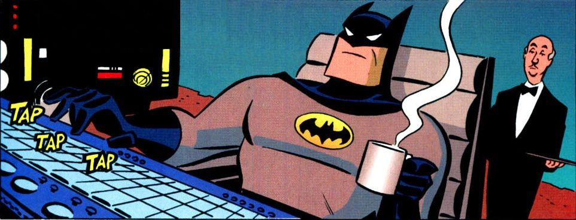

# ud-playground
# C++ Playground & Experimental Projects 🛠️

Welcome to my C++ Playground, a sandbox for experimenting with small projects, algorithms, and learning exercises. This repository contains experimental code and mini-projects I've created to explore C++ concepts and networked applications.

## 📁 Repository Structure

```
├── two_coms/   # Simple client-server chat room
├── maze/       # Randomized maze game with AI bots
```

## 🎯 Project Overview

### 💬 Two_Coms (`two_coms/`)
A simple client-server chat application where a server and client can exchange messages in real-time.


---

### 🎮 Maze Game (`maze/`)
A randomized maze escape game where the player navigates a maze, collects a key, and escapes while avoiding AI-controlled bots.




